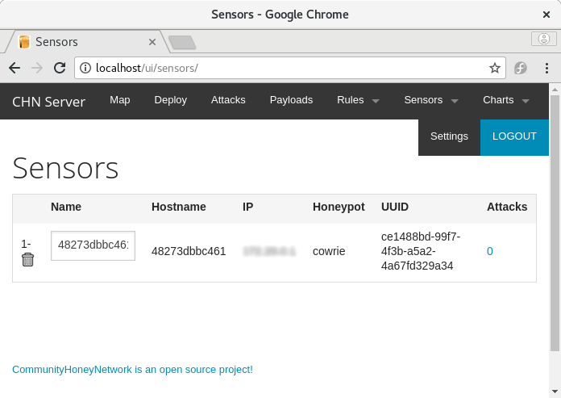
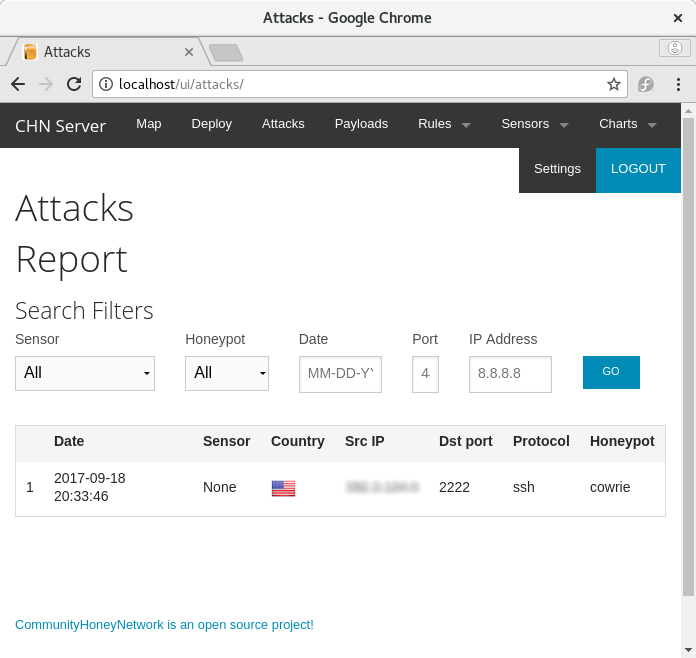

Deploying your First Honeypot
=============================

This example covers how to build and deploy an example [Cowrie honeypot](http://www.micheloosterhof.com/cowrie/) and connect it to a running CommunityHoneyNetwork server for collection of data.

## Prerequisites

The default deployment model uses Docker and Docker Compose to deploy containers for the project's tools, and so, require the following:

* Docker >= 1.13.1
* Docker Compose >= 1.15.0

Note: non-Linux platforms for Docker hosting are known to not work correctly. For example, a Mac Docker host will report the container's gateway as the attacking source.

## Building and Deploying Cowrie

As an example, we'll deploy Cowrie with SSH listening on port 2222.  This is not likely helpful in a production deployment, but will serve as an example for creating a honeypot, registering a new sensor with the management server, and capturing attack data.  For more details on production deployments, see the full [Cowrie Documentation](cowrie.md).


Copy the following Docker Compose yaml, and save it as `docker-compose.yml`:

```
version: '2'
services:
  cowrie:
    image: stingar/cowrie:latest
    volumes:
      - ./cowrie.sysconfig:/etc/sysconfig/cowrie
      - ./cowrie:/etc/cowrie
    ports:
      - "2222:2222"
```

This will tell docker-compose to build the Cowrie container image from the files in the [CommunityHoneyNetwork Cowrie repository](https://github.com/CommunityHoneyNetwork/cowrie), map port 2222 on the host to port 2222 on the container (the default SSH port in the container), and mount two volumes: 

* ./cowrie as /etc/cowrie - to persist the registration information from the management server
* ./cowrie.sysconfig as /etc/sysconfig/cowrie - configuration file for Cowrie (see below)

Before starting the container, copy the following and save it as `cowrie.sysconfig`, setting the `FEEDS_SERVER` to the ip or hostname of the management server the honeypot will be reporting to, and `DEPLOY_KEY` to the deploy key from the management server.

If you haven't yet setup a management server, follow the [Quickstart Guide](quickstart.md)

```
# This file is read from /etc/sysconfig/cowrie or /etc/default/cowrie
# depending on the base distro
#
# This can be modified to change the default setup of the cowrie unattended installation

DEBUG=false

# IP Address of the honeypot
# Leaving this blank will default to the docker container IP
IP_ADDRESS=

# CHN Server api to register to
CHN_SERVER="http://<IP.OR.NAME.OF.YOUR.CHNSERVER>"

# Server to stream data to
FEEDS_SERVER="<IP.OR.NAME.OF.YOUR.HPFEEDS"
FEEDS_SERVER_PORT=10000

# Deploy key from the FEEDS_SERVER administrator
# This is a REQUIRED value
DEPLOY_KEY=

# Registration information file
# If running in a container, this needs to persist
# COWRIE_JSON="/etc/cowrie/cowrie.json

# SSH Listen Port
# Can be set to 22 for deployments on real servers
# or left at 2222 and have the port mapped if deployed
# in a container
SSH_LISTEN_PORT=2222

# Telnet Listen Port
# Can be set to 23 for deployments on real servers
# or left at 2223 and have the port mapped if deployed
# in a container
TELNET_LISTEN_PORT=2223
```

Once you have saved your `docker-compose.yml` file, start the honeypot with:

    $ docker-compose up -d

This command will download the pre-built cowrie image from hub.docker.com, and start your honeypot using this image.

You can verify the honeypot is running with `docker-compose ps`:

    $ docker-compose ps
         Name                    Command              State           Ports         
    --------------------------------------------------------------------------------
    cowrie_centos_1   /sbin/runsvdir -P               Up      0.0.0.0:2222->2222/tcp
                  /etc/service     


When you're ready, the honeypot can be stopped by running `docker-compose down` from the directory containing the docker-compose.yml file.

Your new honeypot should show up within the web interface of your management server under the `Sensors` tab, with the hostname of the container and the UUID that was stored in the cowrie.json file during registration.  As it detects attempts to login to it's fake SSH client, it will send this attack info to the management server.



*Above: A containerized sensor registered to the managment server*

You can now test the honeypot logging by trying to log into the false ssh client running on port 2222:

    $ ssh <ip.of.your.honeypot.host> -P 2222

Attacks logged to your management server will show up under the `Attacks` section in the web interface.



*Above: The Attack Report page of the management server, showing a logged hit to the Cowrie honeypot*


## Troubleshooting

1. If cowrie is unable to register with the management server, make sure your host can communicate with the management server on port 80, or 443 if using SSL (check host and network firewall rules, etc), as well as hpfeeds on port 10000.
