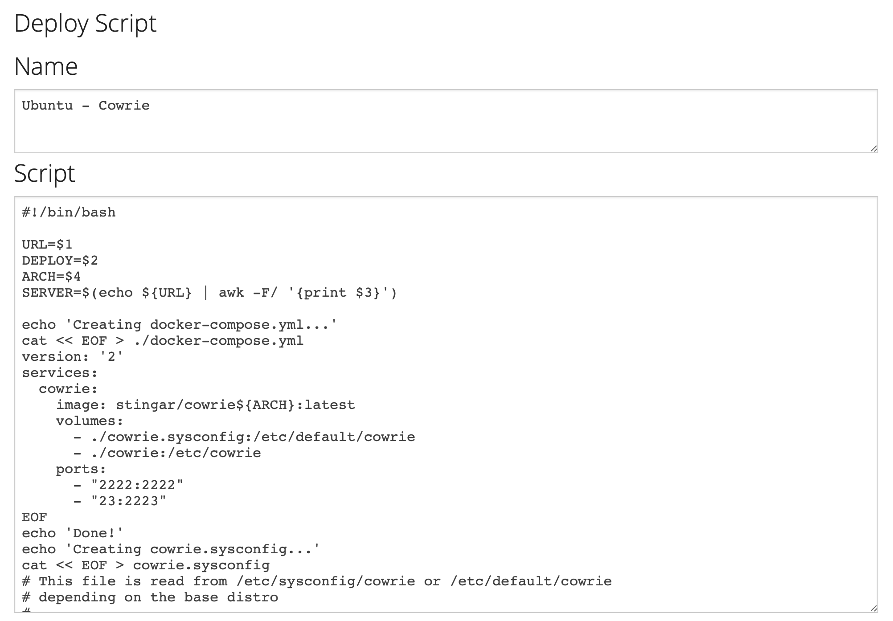

Deploying your First Honeypot
=============================

This example covers how to build and deploy an example [Cowrie honeypot](https://www.cowrie.org/) and connect it to a running CommunityHoneyNetwork server for collection of data.

## Prerequisites

The default deployment model uses Docker and Docker Compose to deploy containers for the project's tools, and so, require the following:

* Docker >= 1.13.1
* Docker Compose >= 1.15.0

**Please ensure the user on the system installing the honeypot is in the local
 docker group**
 
 Please see your system documentation for adding a user to the docker group.

## Deploying Cowrie

As an example, we'll deploy Cowrie with SSH listening on port 2222, and a 
telnet server on port 23.  This is not likely helpful in a production 
deployment, but will serve as an example for creating a honeypot, registering
 a new sensor with the management server, and capturing attack data.  For 
 more details on production deployments, see the full [Cowrie Documentation](cowrie.md).

If you haven't yet setup a management server, follow the [Quickstart Guide](quickstart.md)

Log into the management server and browse to the "Deploy" tab. Once in the 
Deploy section, select the drop-down box with default "New Script" and choose
 the "Ubuntu - Cowrie" option.

Once you've selected the "Ubuntu - Cowrie" script, the page will populate 
with 2 sections; "Deploy Command":

and "Deploy Script": 

Copy the "Deploy Command" section and paste the command into a terminal window on your 
honeypot host.

This command will download the script shown in the "Deploy Script" 
section, execute it, and start the honeypot in the background. The 
script installs a docker-compose.yml file that uses the pre-built cowrie 
image from hub.docker.com, and and a cowrie.sysconfig file setting required 
options.

You can verify the honeypot is running with `docker-compose ps`:

    $ docker-compose ps
        Name                  Command               State                      Ports                    
    ----------------------------------------------------------------------------------------------------
    vcm_cowrie_1   /sbin/runsvdir -P /etc/service   Up      0.0.0.0:2222->2222/tcp, 0.0.0.0:23->2223/tcp 

When you're ready, the honeypot can be stopped by running `docker-compose down` from the directory containing the docker-compose.yml file.

Your new honeypot should show up within the web interface of your management server under the `Sensors` tab, with the hostname of the container and the UUID that was stored in the cowrie.json file during registration.  As it detects attempts to login to it's fake SSH client, it will send this attack info to the management server.

*Above: A containerized sensor registered to the managment server*

You can now test the honeypot logging by trying to log into the false ssh client running on port 2222:

    $ ssh <ip.of.your.honeypot.host> -P 2222

Attacks logged to your management server will show up under the `Attacks` section in the web interface.

*Above: The Attack Report page of the management server, showing a logged hit to the Cowrie honeypot*

## Troubleshooting

1. If cowrie is unable to register with the management server, make sure your host can communicate with the management server on port 80, or 443 if using SSL (check host and network firewall rules, etc), as well as hpfeeds on port 10000.

## Running cowrie on port 22 or port 23
This is covered in the [Cowrie](cowrie.md#running-cowrie-on-port-2223) configuration section
